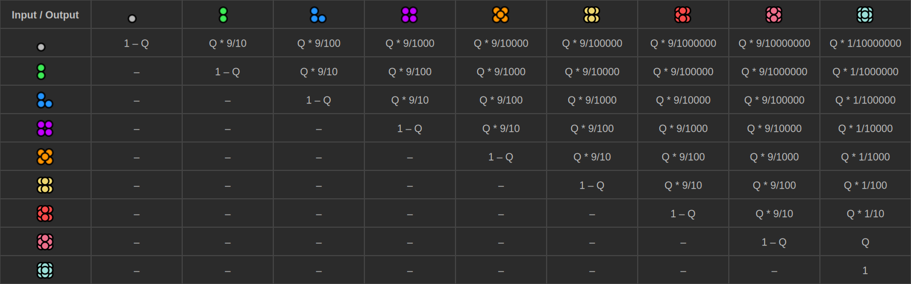
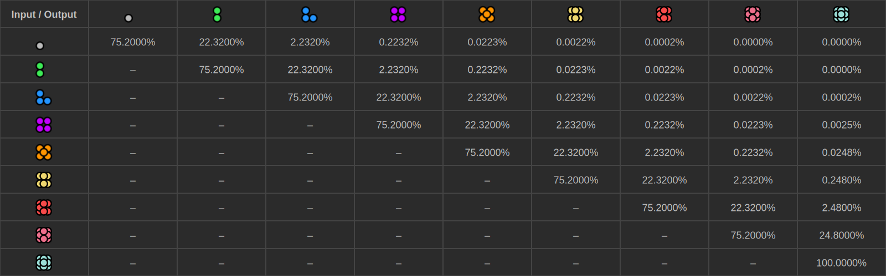

# Quality++

This mod was designed to expand the existing quality system. 

It currently adds 4 different qualities to the game: Mythical, Masterwork, Wondrous, and Artifactual. 

The goal of this mod is to offer more options for late-game resource sinks without divesting far from the original Factorio intent or art style. 

Please report issues that you find. I am more likely to see them here than on the mod portal.

Generalized Space-Gambling Probabilities:

Fixed Space-Gambling Probabilities (Assuming 24.8% Quality):

All qualities are able to be enabled/disabled and have their power modified as deemed necessary by the user.

Reference for how final stats are calculated: https://lua-api.factorio.com/latest/prototypes/QualityPrototype.html

It would be wise to reference the default values for many of these properties. Most are dependant on level.

  <h3>Stats and Modifications</h3>

    Legendary (Reference)
        Level: 5
        beacon_power_usage_multiplier: 1/6
        mining_drill_resource_drain_multiplier: 1/6
        science_pack_drain_multiplier: 95/100

    Mythical
        Level: 6
        beacon_power_usage_multiplier: 1/8
        mining_drill_resource_drain_multiplier: 1/8
        science_pack_drain_multiplier: 94/100
        crafting_machine_energy_usage_multiplier: 2/3
        locomotive_power_multiplier: 2.2
        rolling_stock_max_speed_multiplier: 1.18

    Masterwork
        Level: 7
        beacon_power_usage_multiplier: 1/10
        mining_drill_resource_drain_multiplier: 1/10
        science_pack_drain_multiplier: 93/100
        crafting_machine_energy_usage_multiplier: 1/2
        locomotive_power_multiplier: 2.4
        rolling_stock_max_speed_multiplier: 1.21

    Wondrous
        Level: 8
        beacon_power_usage_multiplier: 1/12
        mining_drill_resource_drain_multiplier: 1/12
        science_pack_drain_multiplier: 92/100
        crafting_machine_energy_usage_multiplier: 1/3
        locomotive_power_multiplier: 2.6
        rolling_stock_max_speed_multiplier: 1.24

    Artifactual
        Level: 10
        beacon_power_usage_multiplier: 1/20
        mining_drill_resource_drain_multiplier: 1/20
        science_pack_drain_multiplier: 90/100
        crafting_machine_energy_usage_multiplier: 1/4
        locomotive_power_multiplier: 3.0
        rolling_stock_max_speed_multiplier: 1.30

  <h3>Built-in Compatibility</h3>

        - Almost anything that unlocks qualities right from the get-go
        - QualityBioLab: https://mods.factorio.com/mod/QualityBioLab (by request)
        - Customizable Quality Names
